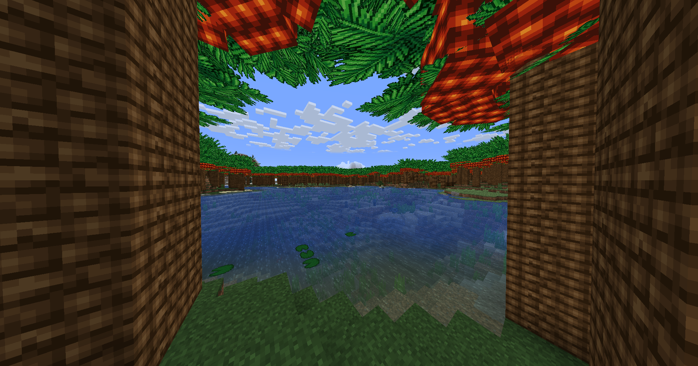
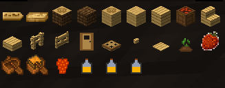
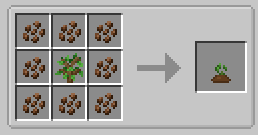
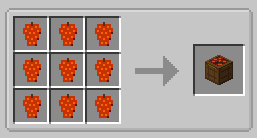
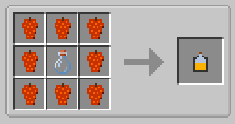
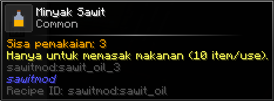

# SawitMod

Hey there! Welcome to SawitMod, a Minecraft 1.20.1 mod that brings a palm oil plantation straight into your world. This mod adds massive palm trees, a muddy swamp village biome, and plenty of palm oil features.



## Features
- **Sawit (Palm) Trees**: Tall palm trees with dense canopies and complete growth stages.
- **Sawit Plantation Biome**: A custom biome that feels like a tropical swamp, complete with mud, waterlilies, frogs, and ambient swamp sounds.
- **Sawit Fruits & Oil**: Harvest palm fruits and process them into palm oil.
- **Sawit Wood**: A complete set of wood blocks ranging from logs and planks to palm boats, doors, and trapdoors.
- **Multi-Loader**: Ready to use on Fabric, Forge, or Quilt.

## Crafting & Mechanics

### Available Items
Here are the items currently available in SawitMod!
*Note: This mod is still under active development, so expect more exciting items and blocks to be added in the future!*



### Palm Seed Crafting
You can craft Sawit Seeds from Sawit Fruits to start your own plantation!



### Sawit Bag
Store your harvested bunches efficiently using the Sawit Bag.



### Palm Oil (Minyak Sawit)
Extract Minyak (Oil) from the Sawit Bunches for various uses.



Here's how the oil processing stages work:




## How to Install
This mod is built using Architectury. Just grab the compiled .jar file and drop it into your mods folder.

Requirements:
- Minecraft 1.20.1
- Fabric API (if you are playing on Fabric)
- Architectury API (depending on your loader)

## Building from Source
If you want to compile the mod yourself, open your terminal in the project folder and run:

```bash
# For Windows
gradlew build

# For Linux/macOS
./gradlew build
```
You can find the compiled .jar files inside the fabric/build/libs, forge/build/libs, or quilt/build/libs folders.

## Credits
Created by KotakLegend.
Thanks for playing!
